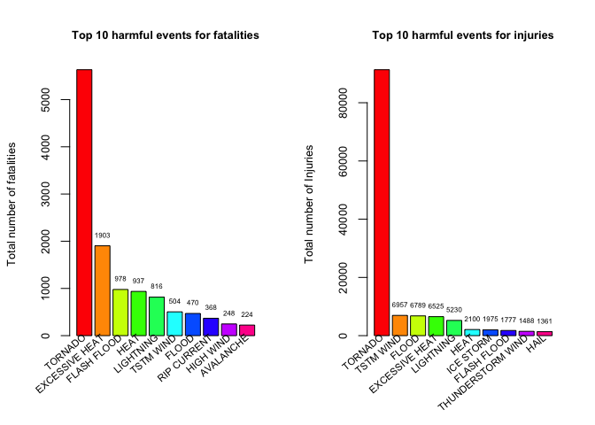
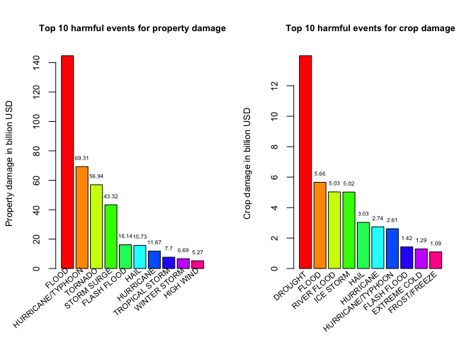

### Introduction
Storms and other severe weather events can cause both public health and economic problems for communities and municipalities. Many severe events can result in fatalities, injuries, and property damage, and preventing such outcomes to the extent possible is a key concern.

This project involves exploring the U.S. National Oceanic and Atmospheric Administration's (NOAA) storm database. This database tracks characteristics of major storms and weather events in the United States, including when and where they occur, as well as estimates of any fatalities, injuries, and property damage.

### Data
The data for this study come in the form of a comma-separeted-value file compressed via the bzip2 algorithm to reduce its size. The file is available [here](https://d396qusza40orc.cloudfront.net/repdata%2Fdata%2FStormData.csv.bz2).

There is also some documentation of the database available. Here you will find how some of the variables are constructed/defined.

* National Weather Service [Storm Data Documentation](https://d396qusza40orc.cloudfront.net/repdata%2Fpeer2_doc%2Fpd01016005curr.pdf)
* National Climatic Data Center Storm Events [FAQ](https://d396qusza40orc.cloudfront.net/repdata%2Fpeer2_doc%2FNCDC%20Storm%20Events-FAQ%20Page.pdf)

The events in the database start in the year 1950 and end in November 2011. In the earlier years of the database there are generally fewer events recorded, most likely due to a lack of good records. More recent years should be considered more complete.

### Synopsis

In this report, the following questions will be addressed:

1. Across the United States, which types of events are most harmful with respect to population health?
2. Across the United States, which types of events have the greatest economic consequences?

### Loading and Processing the data

##### Loading data into R

```r
data <- read.table("repdata-data-StormData.csv.bz2",header = TRUE, sep = ",",stringsAsFactors = FALSE)
head(data)
```

```
##   STATE__           BGN_DATE BGN_TIME TIME_ZONE COUNTY COUNTYNAME STATE
## 1       1  4/18/1950 0:00:00     0130       CST     97     MOBILE    AL
## 2       1  4/18/1950 0:00:00     0145       CST      3    BALDWIN    AL
## 3       1  2/20/1951 0:00:00     1600       CST     57    FAYETTE    AL
## 4       1   6/8/1951 0:00:00     0900       CST     89    MADISON    AL
## 5       1 11/15/1951 0:00:00     1500       CST     43    CULLMAN    AL
## 6       1 11/15/1951 0:00:00     2000       CST     77 LAUDERDALE    AL
##    EVTYPE BGN_RANGE BGN_AZI BGN_LOCATI END_DATE END_TIME COUNTY_END
## 1 TORNADO         0                                               0
## 2 TORNADO         0                                               0
## 3 TORNADO         0                                               0
## 4 TORNADO         0                                               0
## 5 TORNADO         0                                               0
## 6 TORNADO         0                                               0
##   COUNTYENDN END_RANGE END_AZI END_LOCATI LENGTH WIDTH F MAG FATALITIES
## 1         NA         0                      14.0   100 3   0          0
## 2         NA         0                       2.0   150 2   0          0
## 3         NA         0                       0.1   123 2   0          0
## 4         NA         0                       0.0   100 2   0          0
## 5         NA         0                       0.0   150 2   0          0
## 6         NA         0                       1.5   177 2   0          0
##   INJURIES PROPDMG PROPDMGEXP CROPDMG CROPDMGEXP WFO STATEOFFIC ZONENAMES
## 1       15    25.0          K       0                                    
## 2        0     2.5          K       0                                    
## 3        2    25.0          K       0                                    
## 4        2     2.5          K       0                                    
## 5        2     2.5          K       0                                    
## 6        6     2.5          K       0                                    
##   LATITUDE LONGITUDE LATITUDE_E LONGITUDE_ REMARKS REFNUM
## 1     3040      8812       3051       8806              1
## 2     3042      8755          0          0              2
## 3     3340      8742          0          0              3
## 4     3458      8626          0          0              4
## 5     3412      8642          0          0              5
## 6     3450      8748          0          0              6
```
##### Extracting related data

```r
library("dplyr")
weather <- select(data, EVTYPE, FATALITIES, INJURIES, PROPDMG, PROPDMGEXP, CROPDMG, CROPDMGEXP)
colnames(weather) <- c("event.type","fatalities","injuries","property.damage","property.damage.exponent","crop.damage","crop.damage.exponent")
head(weather)
```

```
##   event.type fatalities injuries property.damage property.damage.exponent
## 1    TORNADO          0       15            25.0                        K
## 2    TORNADO          0        0             2.5                        K
## 3    TORNADO          0        2            25.0                        K
## 4    TORNADO          0        2             2.5                        K
## 5    TORNADO          0        2             2.5                        K
## 6    TORNADO          0        6             2.5                        K
##   crop.damage crop.damage.exponent
## 1           0                     
## 2           0                     
## 3           0                     
## 4           0                     
## 5           0                     
## 6           0
```
##### Impact on population health

```r
# Group and summarise data by fatalities and injuries
event.fatal.injur <- group_by(weather,event.type) %>% summarise(fatalities = sum(fatalities,na.rm=TRUE),injuries=sum(injuries,na.rm=TRUE))
# Rank weather events by fatalities and injuries from high to low
event.fatal <- arrange(event.fatal.injur,desc(fatalities))
event.injur <- arrange(event.fatal.injur,desc(injuries))
# Pick the top 10 harmful events
fatal10 <- event.fatal[1:10,]
injur10 <- event.injur[1:10,]
```
##### Impact on economic properties

```r
# Check values in property.damage.exponent
unique(weather$property.damage.exponent)
```

```
##  [1] K M   B m + 0 5 6 ? 4 2 3 h 7 H - 1 8
## Levels:  - ? + 0 1 2 3 4 5 6 7 8 B h H K m M
```

```r
# Check values in crop.damage.exponent
unique(weather$crop.damage.exponent)
```

```
## [1]   M K m B ? 0 k 2
## Levels:  ? 0 2 B k K m M
```
Please click [HERE](https://rstudio-pubs-static.s3.amazonaws.com/58957_37b6723ee52b455990e149edde45e5b6.html) for a brief explanation of "property.damage.exponent" and "crop.damage.exponent".

```r
# Create a function to convert values in property.damage.exponent and cop.damage.exponent to numeric values
exponent <- function(x){
      if (x %in% c("H","h"))
            return(10^2)
      else if (x %in% c("K","k"))
            return(10^3)
      else if (x %in% c("M","m"))
            return(10^6)
      else if (x %in% c("B","b"))
            return(10^9)
      else if (x == "+")
            return(10^0)
      else if (x %in% c("","-","?"))
            return(0)
      else
            return(10)
}
# Create columns to record full information about property and crop damage
property.expo <- sapply(weather$property.damage.exponent,FUN=exponent)
weather$damaged.property <- weather$property.damage * property.expo
crop.expo <- sapply(weather$crop.damage.exponent,FUN=exponent)
weather$damaged.crop <- weather$crop.damage * crop.expo
```

```r
# Group and summarise property and crop damage by events
event.property.crop <- group_by(weather,event.type) %>% summarise(property.damage = sum(damaged.property,na.rm=TRUE),crop.damage=sum(damaged.crop,na.rm=TRUE))
# Rank weather events by property and crop damage from high to low
event.property <- arrange(event.property.crop,desc(property.damage))
event.crop <- arrange(event.property.crop,desc(crop.damage))
# Pick the top 10 harmful events
property10 <- event.property[1:10,]
crop10 <- event.crop[1:10,]
```
### Results
1. Across the United States, which types of events are most harmful with respect to population health?

```r
print(fatal10[,1:2])
```

```
## # A tibble: 10 x 2
##        event.type fatalities
##            <fctr>      <dbl>
##  1        TORNADO       5633
##  2 EXCESSIVE HEAT       1903
##  3    FLASH FLOOD        978
##  4           HEAT        937
##  5      LIGHTNING        816
##  6      TSTM WIND        504
##  7          FLOOD        470
##  8    RIP CURRENT        368
##  9      HIGH WIND        248
## 10      AVALANCHE        224
```

```r
print(injur10[,c(1,3)])
```

```
## # A tibble: 10 x 2
##           event.type injuries
##               <fctr>    <dbl>
##  1           TORNADO    91346
##  2         TSTM WIND     6957
##  3             FLOOD     6789
##  4    EXCESSIVE HEAT     6525
##  5         LIGHTNING     5230
##  6              HEAT     2100
##  7         ICE STORM     1975
##  8       FLASH FLOOD     1777
##  9 THUNDERSTORM WIND     1488
## 10              HAIL     1361
```

```r
par(mfrow=c(1,2),cex.main=0.8,cex.lab=0.8,cex.axis=0.8)
# Make a plot of the top 10 harmful events for causing fatalities
events.fatal <- fatal10$event.type
colors.fatal <- rainbow(10)
plot1 <- barplot(fatal10$fatalities,col=colors.fatal)
text(x = plot1, y = fatal10$fatalities, label = fatal10$fatalities, pos = 3, cex = 0.5)
text(plot1,par("usr")[1],labels=events.fatal,srt=40, adj = 1, xpd=TRUE,cex=0.7)
title(main="Top 10 harmful events for fatalities",ylab="Total number of fatalities")
# Make a plot of the top 10 harmful events for causing injuries
events.injur <- injur10$event.type
colors.injur <- rainbow(10)
plot2 <- barplot(injur10$injuries,col=colors.injur)
text(x = plot2, y = injur10$injuries, label = injur10$injuries, pos = 3, cex = 0.5)
text(plot2, par("usr")[1],labels=events.injur,srt=40, adj = 1, xpd=TRUE,cex=0.7)
title(main="Top 10 harmful events for injuries",ylab="Total number of Injuries")
```

<!-- -->

The above plot shows that "tornado" was the most harmful weather event for both fatalities and injuries. Besides, it was much worse than any other severe weather events. It caused about 2 times more fatalities and about 12 times more injuries than the 2nd most harmful weather events for fatalities and injuries respectively.

2. Across the United States, which types of events have the greatest economic consequences?


```r
print(property10[,1:2])
```

```
## # A tibble: 10 x 2
##           event.type property.damage
##               <fctr>           <dbl>
##  1             FLOOD    144657709800
##  2 HURRICANE/TYPHOON     69305840000
##  3           TORNADO     56937162897
##  4       STORM SURGE     43323536000
##  5       FLASH FLOOD     16140815011
##  6              HAIL     15732269877
##  7         HURRICANE     11868319010
##  8    TROPICAL STORM      7703890550
##  9      WINTER STORM      6688497260
## 10         HIGH WIND      5270046280
```

```r
print(crop10[,c(1,3)])
```

```
## # A tibble: 10 x 2
##           event.type crop.damage
##               <fctr>       <dbl>
##  1           DROUGHT 13972566000
##  2             FLOOD  5661968450
##  3       RIVER FLOOD  5029459000
##  4         ICE STORM  5022113500
##  5              HAIL  3025954650
##  6         HURRICANE  2741910000
##  7 HURRICANE/TYPHOON  2607872800
##  8       FLASH FLOOD  1421317100
##  9      EXTREME COLD  1292973000
## 10      FROST/FREEZE  1094086000
```

```r
par(mfrow=c(1,2),cex.main=0.8,cex.lab=0.8,cex.axis=0.8)
# Make a plot of the top 10 harmful events for property damage
events.property <- property10$event.type
colors.property <- rainbow(10)
plot3 <- barplot(round(property10$property.damage/10^9,digits=2),col=colors.property)
text(x = plot3, y = round(property10$property.damage/10^9,digits=2), label = round(property10$property.damage/10^9,digits=2), pos = 3, cex = 0.5)
text(plot3,par("usr")[1],labels=events.property,srt=40, adj = 1, xpd=TRUE,cex=0.7)
title(main="Top 10 harmful events for property damage",ylab="Property damage in billion USD")
# Make a plot of the top 10 harmful events for causing injuries
events.crop <- crop10$event.type
colors.crop <- rainbow(10)
plot4 <- barplot(round(crop10$crop.damage/10^9,digits=2),col=colors.crop)
text(x = plot4, y = round(crop10$crop.damage/10^9,digits=2), label = round(crop10$crop.damage/10^9,digits=2), pos = 3, cex = 0.5)
text(plot4, par("usr")[1],labels=events.crop,srt=40, adj = 1, xpd=TRUE,cex=0.7)
title(main="Top 10 harmful events for crop damage",ylab="Crop damage in billion USD")
```

<!-- -->

The above plot shows that "flood" caused most property damage, which was about twice of the second harmful weather event. "Drought" caused more crop damage than any other severe weather events.
